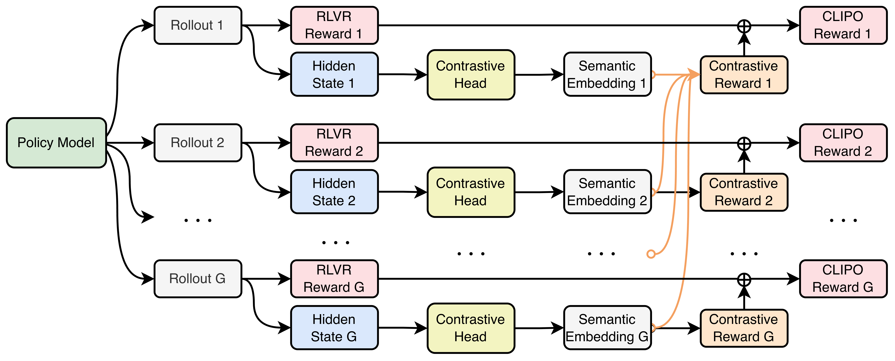

<div align="center">
<h1>CLIPO: Contrastive Learning in Policy Optimization Generalizes RLVR</h1>


<!-- Badges -->
<a></a> 
<a href="https://arxiv.org/abs/2603.10101"></a> 
<a href="https://github.com/Qwen-Applications/CLIPO"></a> 
<a href="https://opensource.org/licenses/Apache-2.0"></a>


<p align="center">
  <i><b>  Qwen Large Model Application Team, Alibaba</b></i>
</p>

In this project, we provide an implementation of CLIPO (Contrastive Learning in Policy Optimization). CLIPO introduces a lightweight contrastive head and an intra-group contrastive objective into RLVR-style policy optimization. By aligning multiple successful reasoning trajectories and contrasting them against incorrect ones, the method extracts invariant reasoning structures shared by correct rollouts. This yields a dense contrastive reward that complements standard outcome-based verifiable rewards, improving robustness and generalization, especially under distribution shifts and hard mathematical reasoning benchmarks.

<p align="center">
  
</p>
<p align="center">
  <b>Figure 1.</b> Overview of the CLIPO framework. We introduce a Contrastive Head to provide fine-grained, intra-group contrastive reward signals for each response.
</p>

</div>

## ⚙️ 1. Setup and Installation

We use the official [verl](https://github.com/verl-project/verl) Docker image with **verl 0.6** and **sglang 0.5.2**:

- **Docker image**: [verlai/verl (app-verl0.6-transformers4.56.1-sglang0.5.2-mcore0.13.0-te2.2)](https://hub.docker.com/layers/verlai/verl/app-verl0.6-transformers4.56.1-sglang0.5.2-mcore0.13.0-te2.2/images/sha256-3c7e1c69e30fc7a60f04581e666f1c0aafe99be23047e7965e0dd12eea8d5ef9)

**Patch SGLang** for sequence-level hidden states. We obtain sequence-level hidden states via **mean pooling** during rollout. This is implemented by patching sglang’s `scheduler_output_processor_mixin.py`. From the repo root, run:

```bash
bash modified/sglang_modify.sh
```

The script copies `modified/scheduler_output_processor_mixin.py` into your sglang installation (and backs up the original).

## 📥 2. Data and Model Preparation

For convenience, we provide the full training and evaluation data used in the paper under the `data` directory:

- **Training data**: `data/train/`
- **Test data**: `data/test/`

Clone this repository to your working directory and prepare a base model (e.g. [Qwen2.5-3B-Instruct](https://huggingface.co/Qwen/Qwen2.5-3B-Instruct), [Qwen2.5-7B-Instruct](https://huggingface.co/Qwen/Qwen2.5-7B-Instruct)). Set `CLIPO_PATH` and `MODEL_PATH` in the training scripts accordingly.

## 🚀 3. Training and Running

**Prerequisites:** Set `CLIPO_PATH` (repository root) and `MODEL_PATH` (base model path) at the top of the script. Ensure the SGLang patch has been applied and `data/train/` and `data/test/` are in place.

From the repository root, run:

| Track | Script | Training data | Evaluation sets |
|-------|--------|---------------|-----------------|
| **Track I** | `scripts/train_gsm8k.sh` | `gsm8k.parquet` | GSM8K, GSM variants, TheoremQA, MMLU, TruthfulQA, CommonsenseQA |
| **Track II** | `scripts/train_math.sh` | `math75.parquet` | MATH, AIME, AIME 2025, AMC, MATH perturb (simple/hard) |

```bash
bash scripts/train_gsm8k.sh   # Track I: GSM8K
bash scripts/train_math.sh   # Track II: MATH
```

Logs are appended to `train_gsm8k.log` and `train_math.log` respectively.

**Key CLIPO (contrastive head) hyperparameters**:

| Parameter | Default | Description |
|-----------|---------|-------------|
| `con_lm_head_output_size` | 512 (gsm8k) / 2048 (math) | Projection dimension after the contrastive head. |
| `con_lm_head_loss_type` | `infonce_loss` | Loss type: `infonce_loss`, `supcon_loss_out`, `supcon_loss_in`, `soft_nn_loss`. |
| `con_lm_head_temperature` | 0.05 | Temperature for similarity logits; lower values focus more on hard negatives. |
| `con_lm_head_lambda` | 0.2 | Weight of contrastive reward: `contrastive_reward = - lambda * loss` (min reward is clamped to -0.5). |

For the full set of contrastive-head options (e.g. `con_lm_head_type`, `con_lm_head_masked_label`, `con_lm_head_contrastive_level`, `con_lm_head_debias`), see `verl/trainer/config/model/hf_model.yaml`.


## 📁 Repository Structure

```
public-clipo/
├── README.md
├── modified/                          # SGLang patch (mean pooling for sequence-level hidden states)
│   ├── scheduler_output_processor_mixin.py
│   └── sglang_modify.sh
├── scripts/                           # Training scripts
│   ├── train_gsm8k.sh                 # Track I: GSM8K
│   └── train_math.sh                  # Track II: MATH
├── verl/                              # verl + CLIPO
│   ├── trainer/
│   │   ├── main_ppo.py                # entrypoint
│   │   ├── config/
│   │   │   └── model/hf_model.yaml    # Model & contrastive-head config
│   │   └── ppo/
│   │       └── ray_trainer.py         # 🌟 Main CLIPO implementation (ContrastiveHead, supcon loss, contrastive rewards)
│   ├── workers/                       # Actor, rollout, ref; fsdp_workers exposes hidden_size for con_lm_head
│   │   └── config/model.py            # HFModelConfig
│   ├── models/
│   └── ...
└── data/                              # Train and test data
    ├── train/
    └── test/
```

**Core implementations** (`verl/trainer/ppo/ray_trainer.py`): 
- class `ContrastiveHead`
- function `supcon_loss`
- function `compute_contrastive_rewards`

## 🙏 Acknowledgements

This project is built upon several fantastic open-source libraries. We would like to extend our heartfelt gratitude to the developers and communities of:

- [verl](https://github.com/verl-project/verl) — scalable Reinforcement Learning for LLMs
- [SGLang](https://github.com/sgl-project/sglang) — fast inference and rollout backend

## 📜 Citation

If you find our work useful in your research, please consider citing our paper:

```bibtex
@misc{cui2026clipo,
      title={CLIPO: Contrastive Learning in Policy Optimization Generalizes RLVR}, 
      author={Sijia Cui and Pengyu Cheng and Jiajun Song and Yongbo Gai and Guojun Zhang and Zhechao Yu and Jianhe Lin and Xiaoxi Jiang and Guanjun Jiang},
      year={2026},
      eprint={2603.10101},
      archivePrefix={arXiv},
      primaryClass={cs.LG},
      url={https://arxiv.org/abs/2603.10101}, 
}
```